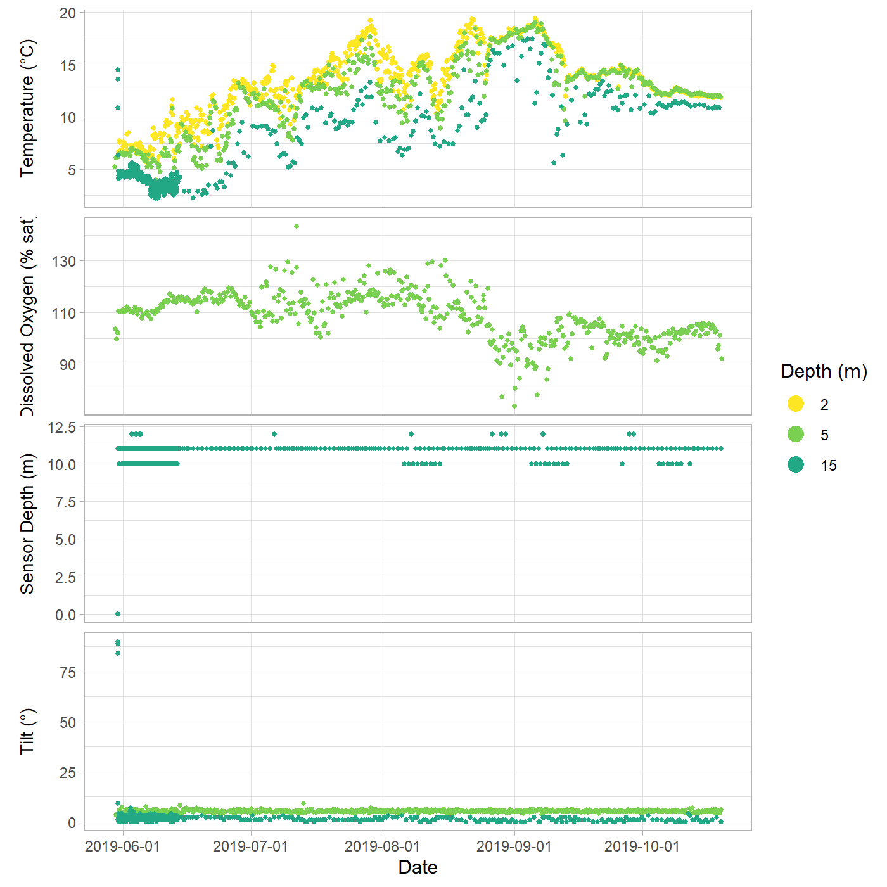

<!-- README.md is generated from README.Rmd. Please edit that file -->

# sensorstrings 

<!-- badges: start -->

[](https://www.gnu.org/licenses/gpl-3.0)
[](https://github.com/Centre-for-Marine-Applied-Research/sensorstrings)
[](https://github.com/Centre-for-Marine-Applied-Research/sensorstrings/actions)
<!-- badges: end -->

`sensorstrings` compiles, formats and visualizes Water Quality data
collected on “sensor strings” by the Centre for Marine Applied Research
([CMAR](https://cmar.ca/)). It reads the raw csv files exported from
each sensor, combines them with the deployment log, and returns one tidy
data frame per deployment, ready for quality control with
[`qaqcmar`](https://github.com/Centre-for-Marine-Applied-Research/qaqcmar).

`sensorstrings` replaces the
[`strings`](https://github.com/Centre-for-Marine-Applied-Research/strings)
package.

## Installation

Install the development version from GitHub:

``` r
# install.packages("remotes")
remotes::install_github("Centre-for-Marine-Applied-Research/sensorstrings")
```

A few functions need extra packages that are not installed
automatically. Install them if you use those functions:

| `sensorstrings` Function | Needs |
|----|----|
| `ss_map_stations()`, `ss_check_station_in_ocean()` | leaflet, sf |
| `ss_open_trimdates_app()` | shiny, plotly |
| `ss_model_mooring()` | mooring (`remotes::install_github("dankelley/mooring")`) |

## Background

CMAR’s [Coastal Monitoring
Program](https://cmar.ca/coastal-monitoring-program/) measures
[Essential Ocean Variables](https://www.goosocean.org/) around the coast
of Nova Scotia, Canada. The program has three branches: *Water Quality*,
*Currents* and *Waves*. `sensorstrings` is the backbone of the Water
Quality data pipeline. Processed data can be viewed and downloaded as
described in the [CMAR Data Access Reference
Sheet](https://cmar.ca/wp-content/uploads/sites/22/2024/07/Report-Data-Access-2024-07-30.pdf).

Water Quality data are collected on vertical moorings called sensor
strings. A typical string is a rope anchored to the seafloor and held up
by a sub-surface buoy, with sensors attached at different depths.
Sensors may also be attached to surface buoys, equipment, floating docks
or fixed structures (Figure 1).


Figure 1: Sensor string configurations (not to scale).

<br> <br>

Every string has at least one temperature sensor, and most have a
dissolved oxygen sensor. Sensors on a string may also measure salinity,
pH, chlorophyll, and sensor depth and tilt. Strings are deployed at a
location for several months and record every 10 minutes to 1 hour,
depending on the sensor.

### Supported Sensors

| Sensor | Folder name | Variables |
|:---|:---|:---|
| HOBO Pro V2 | hobo | temperature |
| HOBO U26 | hobo | temperature, dissolved oxygen |
| HOBO pH | hobo_ph | temperature, pH |
| TidbiT | tidbit | temperature |
| aquaMeasure (DOT, SAL, CHL) | aquameasure | temperature, dissolved oxygen, salinity, chlorophyll, sensor depth, tilt (by model) |
| VR2AR / VR2AR-X (csv from Vue) | vemco | temperature, sensor depth, tilt |
| VR2AR-69 / VR2AR-X-69 (csv from Fathom) | vdat | temperature, sensor depth, tilt |

Each sensor type exports its data with different columns and headers.
`sensorstrings` provides functions to organize, compile, format, and
visualize the data.

`sensorstrings` was built for CMAR’s workflow, but anyone with data from
the sensors above can use it.

For more on how CMAR collects and processes Water Quality data, see the
[CMAR Water Quality Data Collection & Processing Reference
Sheet](https://cmar.ca/wp-content/uploads/sites/22/2024/06/2024-06-17_CMAR_CMP_Workflow.pdf).

## Main functions

| Step | Functions |
|----|----|
| Set up a deployment | `ss_set_up_folders()`, `ss_create_template()`, `ss_create_log_from_metadata()` |
| Read the log | `ss_read_log()`, `ss_parse_log()` |
| Read one raw file | `ss_read_aquameasure_data()`, `ss_read_hobo_data()`, `ss_read_vemco_data()`, `ss_read_vdat_data()` |
| Compile a deployment | `ss_compile_deployment_data()` (calls the `ss_compile_*_data()` function for each sensor type) |
| Check the station | `ss_check_station_radius()`, `ss_check_station_drift()`, `ss_check_station_in_ocean()`, `ss_map_stations()` |
| Reshape | `ss_pivot_longer()`, `ss_pivot_wider()` |
| Plot | `ss_ggplot_variables()`, `ss_plot_variables()`, `ss_open_trimdates_app()` |
| Import, export and assemble | `ss_import_data()`, `ss_export_county_files()`, `ss_assemble_region_data()` |
| Report | `ss_write_report_table()` |

See the [reference
pages](https://Centre-for-Marine-Applied-Research.github.io/sensorstrings/reference/)
for every function.

## Example

``` r
library(sensorstrings)
```

This example uses a string deployed from May 31 to October 19, 2019 with
three sensors. The data files ship with the package.

| Sensor          | Serial number | Depth (m) |
|:----------------|:-------------:|:---------:|
| HOBO Pro V2     |   10755220    |     2     |
| aquaMeasure DOT |    670364     |     5     |
| VR2AR           |    547109     |    15     |

### Raw data

Each sensor’s file has its own layout:

``` r
path <- system.file("extdata", package = "sensorstrings")

aquameasure_raw <- ss_read_aquameasure_data(
  path = file.path(path, "aquameasure"),
  file_name = "aquameasure-670364.csv"
)
hobo_raw <- ss_read_hobo_data(
  path = file.path(path, "hobo"),
  file_name = "10755220.csv"
)
vemco_raw <- ss_read_vemco_data(
  path = file.path(path, "vemco"),
  file_name = "vemco-547109.csv"
)

head(aquameasure_raw)
#>                       Timestamp(UTC) Time Corrected(seconds)             Sensor
#> 1  209s after startup (time not set)                      NA aquaMeasure-670364
#> 2  353s after startup (time not set)                      NA aquaMeasure-670364
#> 3 1226s after startup (time not set)                      NA aquaMeasure-670364
#> 4 2143s after startup (time not set)                      NA aquaMeasure-670364
#> 5 3006s after startup (time not set)                      NA aquaMeasure-670364
#> 6 3875s after startup (time not set)                      NA aquaMeasure-670364
#>        Record Type Dissolved Oxygen Temperature Device Tilt Battery Voltage
#> 1      Device Tilt               NA          NA        90.4              NA
#> 2      Temperature               NA       22.68          NA              NA
#> 3 Dissolved Oxygen            100.5          NA          NA              NA
#> 4      Device Tilt               NA          NA        91.0              NA
#> 5      Device Tilt               NA          NA        91.1              NA
#> 6 Dissolved Oxygen            100.5          NA          NA              NA
#>   TimeSet Time Text
#> 1      NA   NA   NA
#> 2      NA   NA   NA
#> 3      NA   NA   NA
#> 4      NA   NA   NA
#> 5      NA   NA   NA
#> 6      NA   NA   NA
head(hobo_raw)
#>    # Date Time, GMT+00:00 Temp, °C (LGR S/N: 10755220, SEN S/N: 10755220) V4
#> 1  4     2019-05-30 21:00                                           6.661 NA
#> 2  8      2019-05-31 1:00                                           7.695 NA
#> 3 12      2019-05-31 5:00                                           7.569 NA
#> 4 16      2019-05-31 9:00                                           6.509 NA
#> 5 20     2019-05-31 13:00                                           6.788 NA
#> 6 24     2019-05-31 17:00                                           6.839 NA
#>   Coupler Attached (LGR S/N: 10755220) Host Connected (LGR S/N: 10755220)
#> 1                                   NA                                 NA
#> 2                                   NA                                 NA
#> 3                                   NA                                 NA
#> 4                                   NA                                 NA
#> 5                                   NA                                 NA
#> 6                                   NA                                 NA
#>   Stopped (LGR S/N: 10755220) End Of File (LGR S/N: 10755220)
#> 1                                                            
#> 2                                                            
#> 3                                                            
#> 4                                                            
#> 5                                                            
#> 6
head(vemco_raw)
#>   Date and Time (UTC)     Receiver    Description  Data Units
#> 1    2019-05-30 18:06 VR2AR-547109          Noise 207.6    mV
#> 2    2019-05-30 18:10 VR2AR-547109     Tilt angle    89     °
#> 3    2019-05-30 18:13 VR2AR-547109    Temperature  13.6    °C
#> 4    2019-05-30 18:17 VR2AR-547109 Seawater depth     0     m
#> 5    2019-05-30 18:21 VR2AR-547109          Noise 178.3    mV
#> 6    2019-05-30 18:25 VR2AR-547109     Tilt angle    84     °
```

### Deployment log

The log holds the deployment and retrieval dates, where the string was
deployed, and the depth of each sensor:

``` r
log <- ss_read_log(path)

log$deployment_dates
#>   start_date   end_date
#> 1 2019-05-30 2019-10-19
log$area_info
#>   region  county waterbody latitude longitude        station lease
#> 1     NA Halifax Shoal Bay 44.77241 -62.72608 Borgles Island    NA
log$sn_table
#>        log_sensor sensor_serial_number depth
#> 1     HOBO Pro V2             10755220     2
#> 2 aquaMeasure DOT               670364     5
#> 3           VR2AR               547109    15
```

### Compile

`ss_compile_deployment_data()` reads the log and every sensor file in
the deployment folder, and returns one data frame:

``` r
dat <- ss_compile_deployment_data(path)
#> aquameasure data compiled
#> hobo data compiled
#> vemco data from sensor <<  547109  >> compiled: Temperature & Seawater depth

kable(head(dat, 10))
```

| region | county | waterbody | station | lease | latitude | longitude | deployment_range | string_configuration | sensor_type | sensor_serial_number | timestamp_utc | sensor_depth_at_low_tide_m | dissolved_oxygen_percent_saturation | sensor_depth_measured_m | temperature_degree_c | tilt_degree |
|:---|:---|:---|:---|:---|---:|---:|:---|:---|:---|---:|:---|---:|---:|---:|---:|---:|
| NA | Halifax | Shoal Bay | Borgles Island | NA | 44.77241 | -62.72608 | 2019-May-30 to 2019-Oct-19 | sub-surface buoy | hobo | 10755220 | 2019-05-30 21:00:00 | 2 | NA | NA | 6.661 | NA |
| NA | Halifax | Shoal Bay | Borgles Island | NA | 44.77241 | -62.72608 | 2019-May-30 to 2019-Oct-19 | sub-surface buoy | hobo | 10755220 | 2019-05-31 01:00:00 | 2 | NA | NA | 7.695 | NA |
| NA | Halifax | Shoal Bay | Borgles Island | NA | 44.77241 | -62.72608 | 2019-May-30 to 2019-Oct-19 | sub-surface buoy | hobo | 10755220 | 2019-05-31 05:00:00 | 2 | NA | NA | 7.569 | NA |
| NA | Halifax | Shoal Bay | Borgles Island | NA | 44.77241 | -62.72608 | 2019-May-30 to 2019-Oct-19 | sub-surface buoy | hobo | 10755220 | 2019-05-31 09:00:00 | 2 | NA | NA | 6.509 | NA |
| NA | Halifax | Shoal Bay | Borgles Island | NA | 44.77241 | -62.72608 | 2019-May-30 to 2019-Oct-19 | sub-surface buoy | hobo | 10755220 | 2019-05-31 13:00:00 | 2 | NA | NA | 6.788 | NA |
| NA | Halifax | Shoal Bay | Borgles Island | NA | 44.77241 | -62.72608 | 2019-May-30 to 2019-Oct-19 | sub-surface buoy | hobo | 10755220 | 2019-05-31 17:00:00 | 2 | NA | NA | 6.839 | NA |
| NA | Halifax | Shoal Bay | Borgles Island | NA | 44.77241 | -62.72608 | 2019-May-30 to 2019-Oct-19 | sub-surface buoy | hobo | 10755220 | 2019-05-31 21:00:00 | 2 | NA | NA | 7.192 | NA |
| NA | Halifax | Shoal Bay | Borgles Island | NA | 44.77241 | -62.72608 | 2019-May-30 to 2019-Oct-19 | sub-surface buoy | hobo | 10755220 | 2019-06-01 01:00:00 | 2 | NA | NA | 7.594 | NA |
| NA | Halifax | Shoal Bay | Borgles Island | NA | 44.77241 | -62.72608 | 2019-May-30 to 2019-Oct-19 | sub-surface buoy | hobo | 10755220 | 2019-06-01 05:00:00 | 2 | NA | NA | 7.544 | NA |
| NA | Halifax | Shoal Bay | Borgles Island | NA | 44.77241 | -62.72608 | 2019-May-30 to 2019-Oct-19 | sub-surface buoy | hobo | 10755220 | 2019-06-01 09:00:00 | 2 | NA | NA | 6.661 | NA |

### Plot

``` r
ss_ggplot_variables(dat, point_size = 1)
```

<!-- -->

## Getting help

Please report bugs or suggest features on the [issues
page](https://github.com/Centre-for-Marine-Applied-Research/sensorstrings/issues).

## AI Disclosure

This README file was generated by Claude Opus 5.5. It was based on an
earlier, human-written version of the README, and was reviewed and
modified before publication.

The original versions of `sensorstrings` were written without any AI.
Since `sensorstrings v1.5.5`, Claude Opus 5.5 has been used to improve
clarity and consistency between CMAR R packages.
